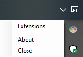

# Overview

This project allows you to run code when a button on a physical device is pressed. In my case, I use this mainly to control [Spotify][spotify] from an [USB Super NES controller][controller], but you can do whatever you want, and technically with whatever [USB (HID)][usb-hid] device you want.

This is an old project (2011 ~ 2015) that I'm still using daily. I open source it because there is absolutely no reasons not to. However, this is a very quickly developed project and the software design is not always ideal.

The `HIDLibrary.Core` was originally part of another project, but I moved the code for simplicity. This library work only on Windows.

# How it works

After **SuperNESController** has started, the icon  appears in the system tray, and by right-clicking it, a context menu appears.

No need to explain what the `About` and `Exit` menus do. The `Extensions` menu opens the extensions window, as follow:

On the left, there is a list of module, and for each module the extensions to expose. Click on an extension, and then the check boxes on the right image get enable. Check the button(s) that will trigger the extension.

For example, as on the image, the `Play/Pause` extension is selected, and for this extension, the red `A` button is checked. That means, when pressing the `A` button, the `Play/Pause` extension will trigger and thus play or pause the currently active application.

For the `Kill Process` extension, the name of the process to kill has to be written in a configuration file. All the details in the source code.

# Solution

The project `HIDLibrary.Core` provides the [HID][usb-hid] functionalities [(Human Interface Device)][usb-hid] to communicate with the [USB Super NES controller][controller]. This code has been tested with the Buffalo model.

The project `SuperNESController.Core` exposes interfaces to create extensions for **SuperNESController**.

The project `SuperNESController` is the host application that runs everything.

The projects `KillProcess` and `StandardMediaPlayer` are extensions. The `StandardMediaPlayer` one is very useful to control your music or video playing, and `KillProcess` was also very useful when I was working with Unity 4.6, when it was crashing 50 times a day and the only way to restart it was to brute-force kill the process. This project can also be a very good example, as it is very simple.

# Build and run

This project targets [.NET Framework 4.5][dotnet-fx45], and can be loaded with [Visual Studio 2019][vs2019] Community edition.

Normally, you should just be able to build and run from Visual Studio. If you want to run it on top of .NET Core (never tested) make sure you have desktop development framework installed.

# Terms of use

[Super NES][super-nes] is a registered trademark or trademark of [Nintendo][nintendo]. 
[Spotify][spotify] is a registered trademark or trademark of [Spotify AB][spotify].

[dotnet-fx45]: https://dotnet.microsoft.com/download/dotnet-framework/net45
[vs2019]: https://visualstudio.microsoft.com/vs
[super-nes]: https://en.wikipedia.org/wiki/Super_Nintendo_Entertainment_System
[nintendo]: https://www.nintendo.com
[spotify]: https://www.spotify.com
[controller]: https://usbsnescontroller.com
[usb-hid]: https://en.wikipedia.org/wiki/USB_human_interface_device_class
